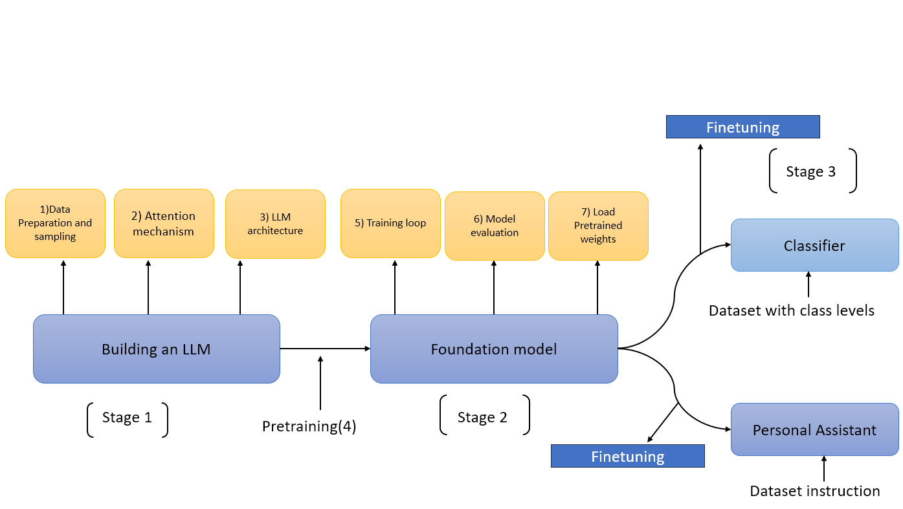
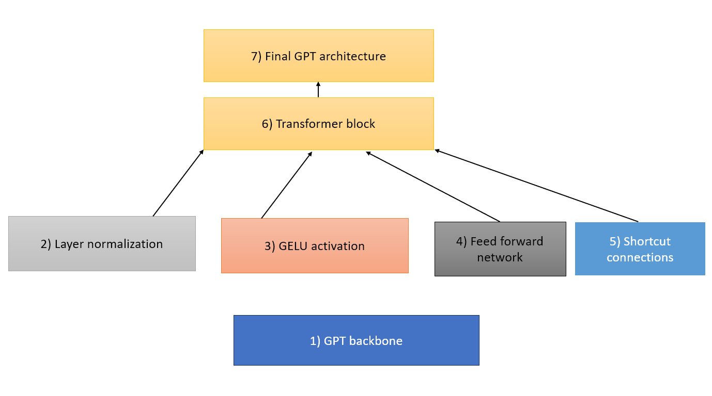
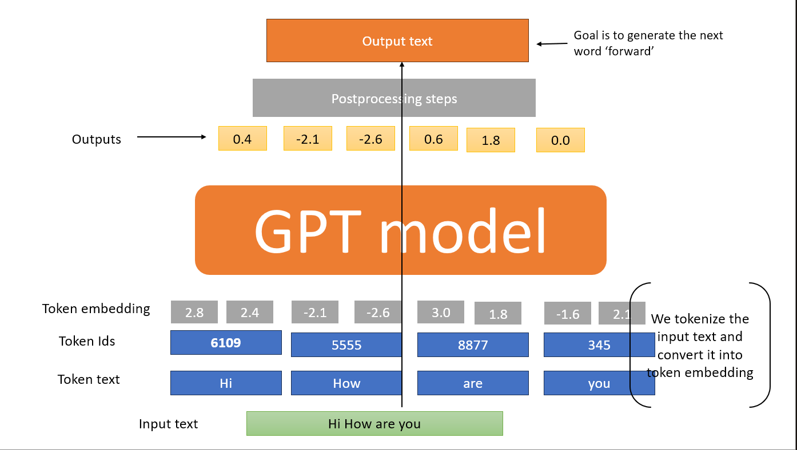

### Implementing a GPT Model from Scratch To Generate Text

## Main Chapter Code
- ch03.ipynb contains all the code as it appears in the chapter
previous_chapters.py is a Python module that contains the MultiHeadAttention module from the previous chapter, which we import in ch04.ipynb to create the GPT model

Ref - image1 

Ref-image2

Ref-image3
